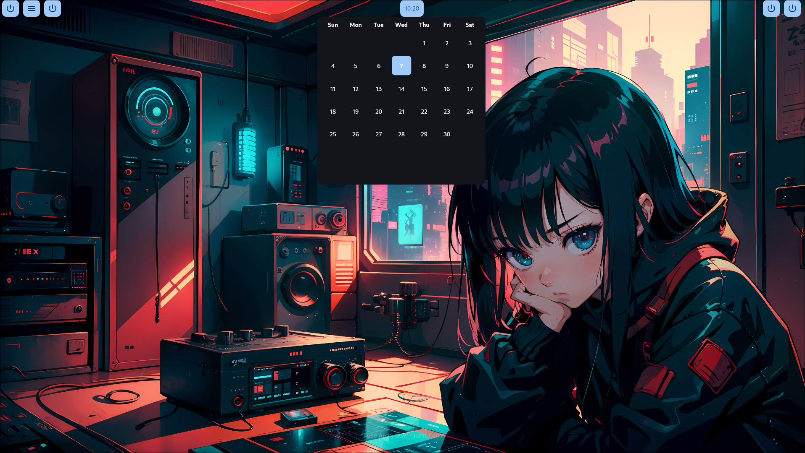
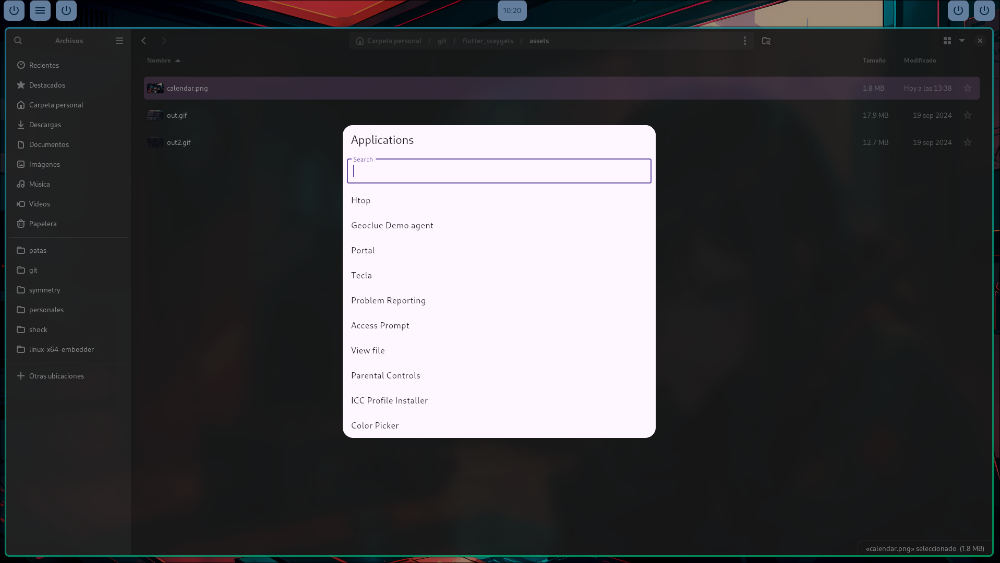

# Flutter embedder to create widgets, panels and menus in wlroots based compositors (Or anything with wlr-layer-shell really).

## This project is the base for the YARA Desktop environment, a Hyprland based Desktop Environment made with flutter tools. You can find that project [here](https://github.com/garcia-s/yara_shell)

This is a "zig" flutter embedder to create flutter widgets for wlr-layer-shell. This is currently a work in progress, with some missing features however it can already be used to create wayland widgets in flutter.

## Screenshots 

### A calendar widget

### A basic App Launcher 

### A Waybar-like exclusive top bar 

## WHY FLUTTER ??

Why not? Flutter is easy to use and  has decent performance. Animations are easy to create, it's really easy to create something cohesive. 

## How to run (These instructions are currently outdated).

Instructions for running the project can be found [here](./instructions.md). Consider this is on VERY early stages of development and I can't guarantee this to be up to date.

## Current features (as of 03-10-2024)

- Multi-window support (as in Creating multiple wayland surfaces)
- Simple pointer events (5 mouse buttons and things like long press)
- Flutter rendering directly into egl-wayland surfaces
- Keyboard working-ish with composite utf-8 character support(ish)

